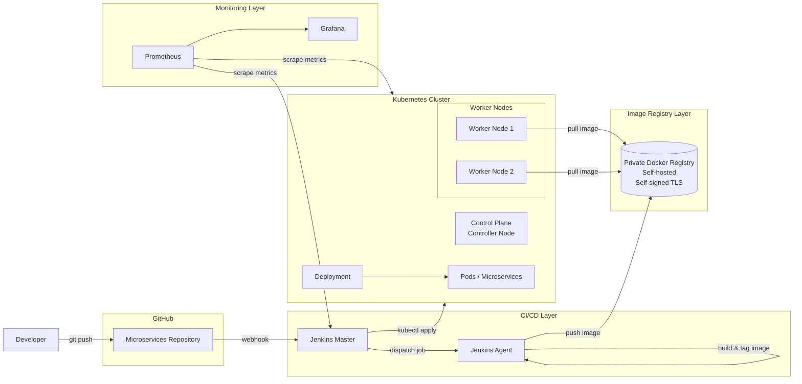

## Bài lab: Xây dựng hệ thống CI/CD cho Microservices với Jenkins & Kubernetes
1.Giới thiệu: 
Bài lab này mô phỏng một hệ thống CI/CD end-to-end cho kiến trúc microservices,
sử dụng Jenkins để tự động hóa quy trình build và deploy,
Docker Registry riêng để lưu trữ image,
và Kubernetes (kubeadm) để triển khai và vận hành các service.

Mục tiêu của bài lab là giúp hiểu rõ luồng CI/CD thực tế,
cách Kubernetes pull image từ private registry,
và cách xử lý các lỗi thường gặp trong quá trình triển khai.

## Architecture

## 2. Kiến trúc tổng thể

### 2.1 Tổng quan kiến trúc

Hệ thống được thiết kế theo mô hình **CI/CD tách biệt**, triển khai trên **Kubernetes** và **giám sát tập trung**, phù hợp với mô hình triển khai phổ biến trong môi trường doanh nghiệp.

Kiến trúc tổng thể bao gồm các lớp thành phần chính:

- **CI/CD Layer**: Jenkins Master, Jenkins Agent
- **Image Registry Layer**: Private Docker Registry
- **Container Orchestration Layer**: Kubernetes Cluster
- **Monitoring Layer**: Prometheus và Grafana

Các thành phần được triển khai trên **các máy ảo độc lập** nhằm:

- Mô phỏng đúng mô hình triển khai thực tế
- Đảm bảo tính tách biệt về vai trò và trách nhiệm
- Hạn chế ảnh hưởng chéo về hiệu năng giữa các hệ thống

---

### 2.2 CI/CD Layer – Jenkins

#### 2.2.1 Jenkins Master

Jenkins Master đóng vai trò trung tâm trong hệ thống CI/CD, chịu trách nhiệm:

- Nhận webhook từ GitHub repository khi có thay đổi mã nguồn
- Quản lý và điều phối pipeline CI/CD
- Phân phối job xuống các Jenkins Agent
- Quản lý cấu hình pipeline, plugin và credential

Jenkins Master **không trực tiếp build image** nhằm đảm bảo:

- Tính ổn định của hệ thống CI/CD
- Khả năng mở rộng và bảo trì lâu dài

#### 2.2.2 Jenkins Agent

Jenkins Agent được Jenkins Master điều khiển và chịu trách nhiệm thực thi các tác vụ CI, bao gồm:

- Checkout mã nguồn từ GitHub
- Build Docker image cho từng microservice
- Gắn tag image theo version hoặc build number
- Push image lên Private Docker Registry

Việc tách Jenkins Master và Agent giúp:

- Giảm tải cho Jenkins Master
- Dễ dàng mở rộng số lượng agent
- Phù hợp với hệ thống CI/CD từ nhỏ đến lớn

---

### 2.3 Image Registry Layer – Private Docker Registry

Private Docker Registry được triển khai theo mô hình **self-hosted** sử dụng Docker.

Đặc điểm triển khai:

- Sử dụng tên miền riêng
- Bảo mật bằng chứng chỉ tự ký (self-signed certificate)

Chức năng chính:

- Lưu trữ Docker image được build từ Jenkins
- Cung cấp image cho Kubernetes trong quá trình deploy

Các node Kubernetes được cấu hình để:

- Tin cậy CA của private registry
- Pull image trực tiếp trong quá trình tạo Pod

---

### 2.4 Container Orchestration Layer – Kubernetes Cluster

#### 2.4.1 Kiến trúc cụm Kubernetes

Cụm Kubernetes được triển khai bằng **kubeadm**, bao gồm:

- **01 Control Plane Node**
  - API Server
  - Scheduler
  - Controller Manager
  - etcd

- **02 Worker Nodes**
  - Chạy các workload như Pod và Deployment

#### 2.4.2 Networking

Hệ thống sử dụng **Calico CNI**, cung cấp:

- Kết nối mạng Pod-to-Pod
- Khả năng áp dụng Network Policy trong tương lai

#### 2.4.3 Triển khai ứng dụng

Ứng dụng được triển khai thông qua **Deployment**, Kubernetes tự động:

- Pull image từ Private Docker Registry
- Quản lý vòng đời Pod
- Thực hiện rolling update khi image thay đổi

---

### 2.5 Monitoring Layer – Prometheus và Grafana

Hệ thống monitoring được triển khai trên **server riêng** nhằm đảm bảo tính ổn định.

Các thành phần chính:

- **Prometheus**: Thu thập và lưu trữ metrics
- **Grafana**: Hiển thị dashboard và trực quan hóa dữ liệu

Các đối tượng được giám sát:

- Jenkins: Job executor, pipeline status
- Kubernetes Cluster:
  - Node
  - Pod
  - CPU / Memory usage

Việc tách riêng monitoring giúp:

- Không ảnh hưởng đến hiệu năng CI/CD và Kubernetes
- Dễ dàng tích hợp Alertmanager trong tương lai

---

